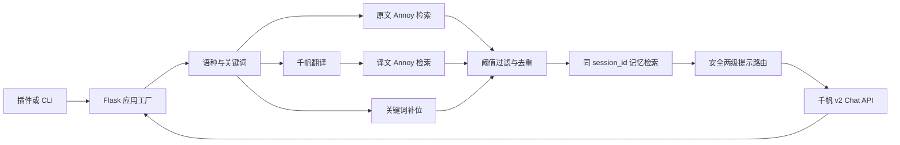

# 项目架构

## 产品边界

一言鼎臻面向 PT、CYPT、CUPT、IYPT 等物理竞赛场景，提供两项公开能力：

1. 根据用户问题检索本地物理知识库并生成回答。
2. 读取用户提供的远程文档并生成分层总结。

外部继续保留：

- `POST /set_Query`
- `POST /set_text`

命令行和 HTTP 服务共享同一个 `AnswerService`，所有重型模型与索引均延迟初始化。

## 问答数据流

远程文档在进入服务前经过 URL、DNS、TCP 对端、重定向、响应大小、压缩大小、页数和格式限制。

## 模块职责

| 模块 | 职责 |
|---|---|
| `config.py` | 环境变量、路径和运行限制 |
| `app.py` | Flask 应用工厂、插件接口与错误映射 |
| `cli.py` | 交互问答、单次问答、文档总结和服务启动 |
| `llm.py` | 千帆 v2 客户端与 SentenceTransformer 包装 |
| `query.py` | 查询对象、语种识别、关键词和翻译 |
| `retrieval.py` | Annoy、关键词补位和记忆向量检索 |
| `memory.py` | 按 `session_id` 隔离、带上限的线程安全短期记忆 |
| `prompts.py` | 原型提示词、路由元数据与兼容辅助对象 |
| `routing.py` | 无 LangChain 依赖的两级路由、解析和回退 |
| `service.py` | 组合查询、检索、记忆与回答生成 |
| `documents.py` | PDF、DOCX、Markdown、TXT 文本提取 |
| `downloader.py` | 受限远程文件下载 |
| `textsplit.py` | 中英文标点感知的两级文本切分 |

## 模型适配

`QianfanChatModel` 只接受纯文本提示，固定访问官方 HTTPS `v2/chat/completions`：

- Bearer API Key 不进入对象 `repr` 或错误消息。
- 连接与读取使用独立超时。
- HTTP 错误只暴露状态码和可用请求 ID。
- JSON、`choices`、`message` 和 `content` 都执行结构校验。
- 不自动重试付费请求，避免不明确的重复计费。

默认模型是 `ernie-4.5-turbo-128k`，可通过环境变量覆盖。百度会更新和退役模型，部署方应根据[官方模型列表](https://cloud.baidu.com/doc/qianfan-api/s/Dmba8k71y)维护模型 ID。

## 路由兼容与安全

历史的一级和二级路由提示文本保持不变，但运行时不再依赖 `MultiPromptChain`：

1. 模型返回 fenced 或普通 JSON。
2. 解析器只接受当前候选 destination。
3. `DEFAULT`、非法、超长或畸形输出回退到原始问题。
4. 模型给出的 `next_inputs` 不允许改写用户输入。
5. 选择最终模板后再调用一次模型生成答案。

13 个物理子领域、总结提示、生活提示和路由提示都有固定 SHA-256 快照测试。

## 检索契约

默认使用权威应用实际加载的 `2018` 索引：

- 维度：768
- metric：`dot`
- 嵌入模型：`sentence-transformers/paraphrase-multilingual-mpnet-base-v2`
- 归一化：开启
- 当前知识库阈值：`0.6`
- 当前知识库片段：最多 3
- 同会话历史片段：最多 3，阈值 `0.58`

对该 `dot` 索引的实测是分数越高越相关。这个语义不能直接套用到其他 Annoy metric。
运行时会拒绝非 `dot` 索引，防止把距离值误当作相似度分数。

这里的短期记忆延续历史实现：检索以前轮次使用过的支持资料，而不是重放模型回答。提示词中“之前答案”的旧措辞为兼容性保持不变。
关键词补位同样延续历史行为，只使用原始问题提取的关键词；翻译文本用于第二路向量检索。

## 资产边界

运行时不反序列化 `embedding.pkl` 或 LangChain `index.pkl`：

- 嵌入模型按标准模型名初始化。
- Annoy 二进制保留为 `index.annoy`。
- 文档映射迁移为可审计的 `documents.json`。

模型权重、原始论文、教材、CAJ、pickle 和生成索引不进入普通 Git。索引清单使用 SHA-256 标识本地资产。

## 会话与部署

历史实现把所有用户放在一个全局记忆列表。当前实现：

- 客户端传入 `session_id` 时复用该会话。
- 未传入时服务生成随机 ID 并返回。
- 每个会话和总会话数都有上限。
- 同一进程内的数据结构有锁保护。
- 记忆不持久化，多进程之间不共享。

应用本身不提供身份认证或速率限制。公开部署必须配置 API Gateway 或反向代理、TLS、认证、限流、日志脱敏和 `YDZ_PUBLIC_BASE_URL`。
